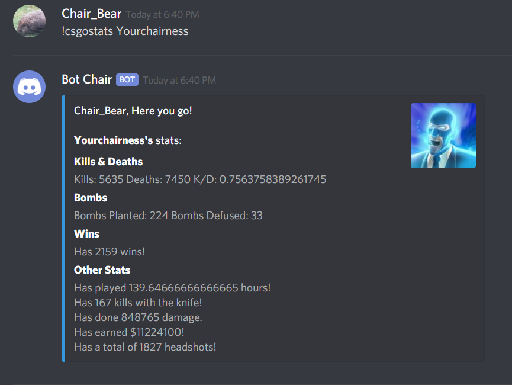
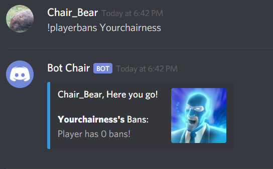
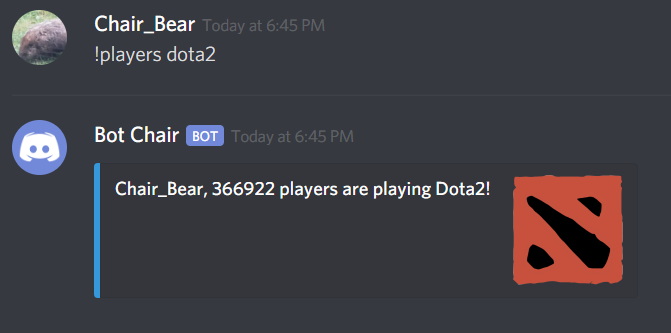
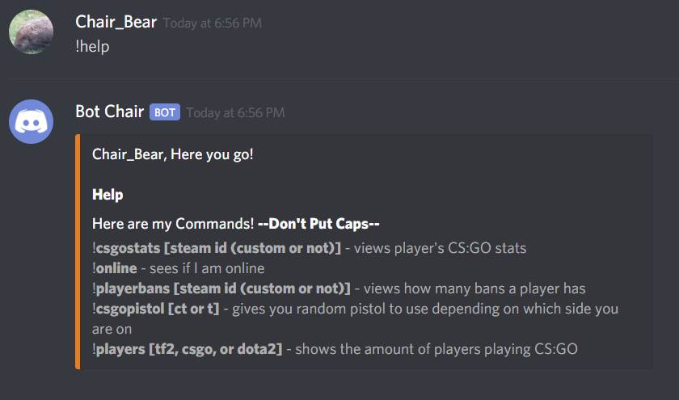

# SteamDiscordBot
This is a discord bot that gets player information (mainly from CS:GO) using Steam's API services. This bot takes user input such as a player's steam id, CS:GO team, and game name. When giving the bot your id, you can use your custom id or your SteamID64. Regardless of which one you use, the bot will work the same.

You can get a Steam API key [here](https://steamcommunity.com/dev/apikey).

You can create a Discord Bot [here](https://discordapp.com/login?redirect_to=%2Fdevelopers%2Fapplications%2F)

Follow the directions [here](https://support.discordapp.com/hc/en-us/articles/206346498-Where-can-I-find-my-User-Server-Message-ID-) to get the id.

`!csgostats [steam id (custom or not)]` - views plaer's CS:GO stats

`!online` - sees if I am online

`!playerbans [steam id (custom or not)]` - views how mant bans a player has

`!csgopistol [ct or t]` - tells you a random pistol to use depending on which side you are on

`!players [tf2, csgo, or dota2]` - shows the amount of payers playing the respective game.

`!help` - shows user list of commands

# Setup

In each of the text files, delete everything and put in your information. For example, I would open up the token.txt and put in my token.
